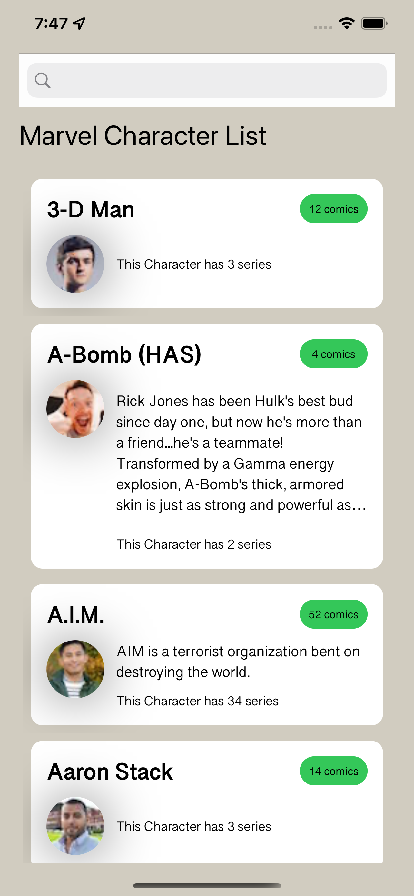

# MarvelHeroes
This is a repo to display a list of heroes from the marvel API.

Architecture
-----------

In this proyect we aim to create an arquitectue as layer separeted with  network layer that consist in a service or `ApiClient` which would use a resquest type that is extendable to request any type of data by using the `Routers` which will be in charge of the components that the service needs in order to send a full request. the project in general uses the desing pattern of MVC since this is a small project this arquitecture allows for quicker development to achieve the goal. We address the problem of MMVC (Massive View Controller) we use the power of swift extensions to separate our app files in extensions that isolate especific functionalities of the app for example the files named like `feature+"Controller"` are meant for performing calls to the network. 

Another Part of the arquitecture is that we separated the Domain and UI from the features in different folders `Application` contains the features, `UI` contains reusable views that we can share along the app, and the `Model`  contains model objects that we use along the app this allows for further separation on the future being able to separate this into frameworks that other apps can use.

Tools
------------

In this project we use a list of tools in order to give live to it.

  - auto-layout
  - swiftlint
  - XCTest

Third Party
------------

  - Nuke: Is used in the app to load images from url is a convenient helper that makes easy dealing with loading images and adding placeholders while they are laodin.
  - Anchorage: this is a third party that creates a wrapper for the programatic autolayout based on anchors and is really simple to use enables setting constraints programatically in a faster and fanishioned manner.

Screenshots
------------
Home
--------

Videos
------------
